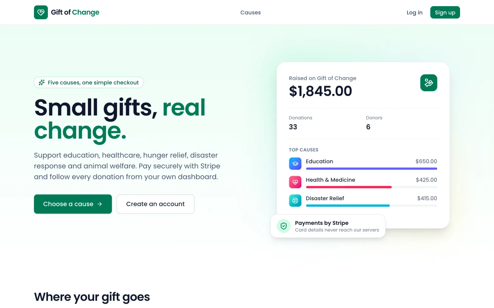
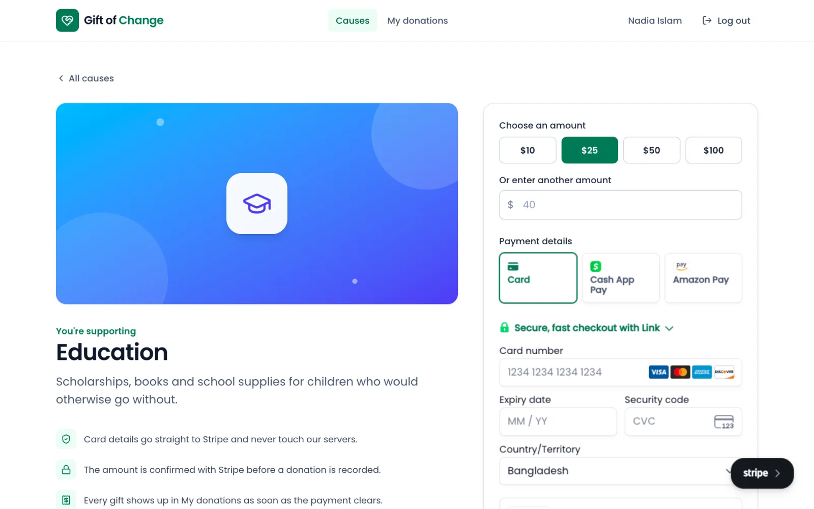
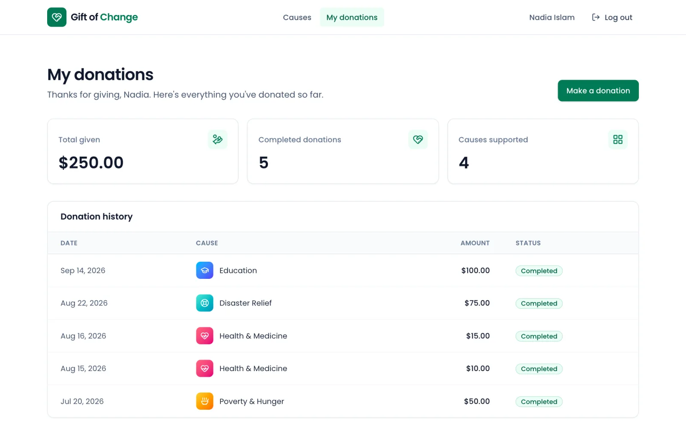
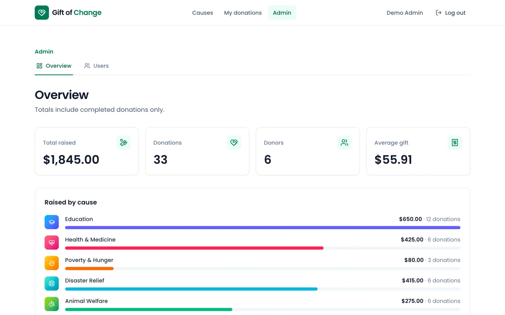
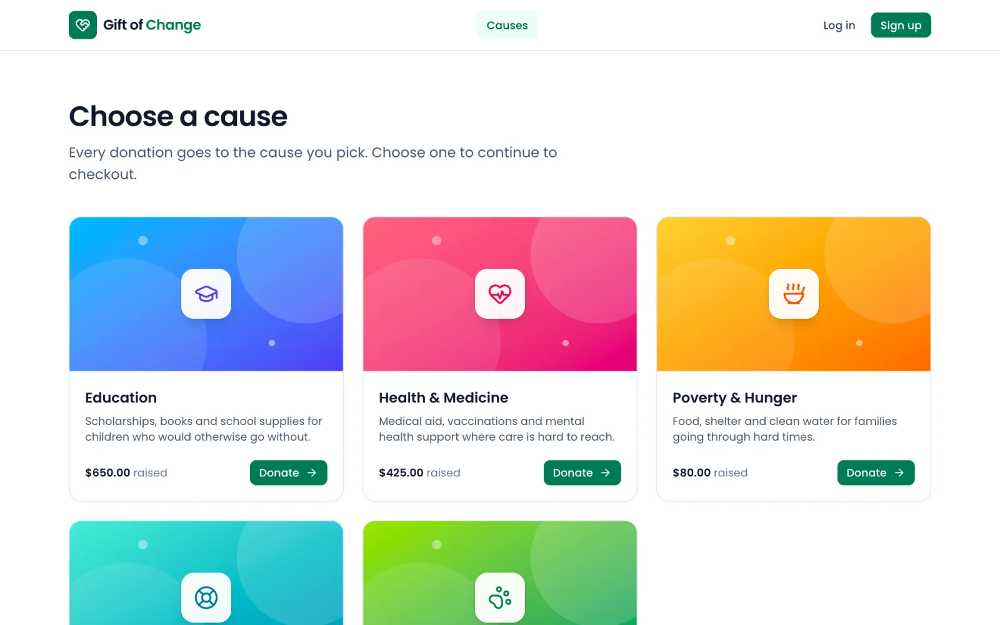
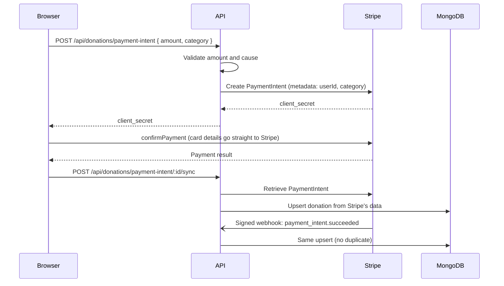

# Gift of Change

[](https://github.com/abirzishan32/donation-website/actions/workflows/ci.yml)
[](LICENSE)


A full-stack donation platform. Donors pick a cause, pay through Stripe and keep a history of every gift. Admins see how much each cause has raised and manage accounts.

Built with React, Express, MongoDB and Stripe.



## What it does

People can give to five causes: education, health, poverty and hunger, disaster relief and animal welfare. After creating an account, a donor chooses an amount and pays with Stripe's Payment Element. The donation then appears in their history with its status (completed, pending or failed).

Admins get a dashboard with the total raised, number of donors, average gift and a breakdown by cause, plus a filterable list of every donation and a user list where donor accounts can be removed.

Payments run in Stripe test mode, so no real money moves.

|                            Checkout                            |                         Donation history                          |
| :------------------------------------------------------------: | :---------------------------------------------------------------: |
|  |  |
|                       **Admin overview**                       |                            **Causes**                             |
|       |                   |

## Features

For donors:

- Sign up and log in. Sessions use JWTs and survive a page reload.
- Donate $10, $25, $50 or $100 in one click, or type any amount from $1 to $10,000.
- Pay by card or any other method enabled in the Stripe dashboard, including 3D Secure flows.
- See lifetime totals and the status of each donation.
- Update name, email and password (changing email or password asks for the current password).

For admins:

- Totals for completed donations, overall and per cause.
- Every donation with the donor's name, filterable by status and paginated on the server.
- A user list showing how much each person has given. Deleting a donor keeps their donation records for bookkeeping.

## How payments work

The browser never tells the server how much was paid. Every donation record is built from the PaymentIntent that Stripe itself returns.



A few details worth pointing out:

- The amount, currency, donor and cause are read from the PaymentIntent, so an edited request can't create or inflate a donation.
- The Stripe webhook is the source of truth. It records donations even when a donor closes the tab right after paying. The endpoint verifies Stripe's signature against the raw request body.
- The sync call exists so the donor sees their donation immediately instead of waiting for the webhook. Both paths go through one idempotent function keyed on the PaymentIntent id, which has a unique index, so running them together still produces a single record.
- A late `processing` event can't overwrite a completed donation, and declined cards don't leave records behind.

## Tech stack

| Area     | Tools                                                                           |
| -------- | ------------------------------------------------------------------------------- |
| Frontend | React 19, React Router 8, Tailwind CSS 4, Vite 8, Stripe Payment Element, Axios |
| Backend  | Node.js, Express 5, MongoDB with Mongoose 9, Zod, JSON Web Tokens, bcrypt       |
| Security | Helmet, CORS allow-list, rate limiting on login and payment endpoints           |
| Testing  | Vitest, Supertest, mongodb-memory-server, React Testing Library                 |
| Tooling  | npm workspaces, ESLint, Prettier, GitHub Actions                                |

## Project structure

```
.
├── client/                  React app (Vite)
│   └── src/
│       ├── api/             Axios instance and API calls
│       ├── components/      Layout, UI components, checkout, route guards
│       ├── constants/       Cause definitions
│       ├── context/         Auth provider
│       ├── hooks/           useAuth, useApiQuery
│       ├── lib/             Formatting, amount validation, Stripe setup
│       └── pages/           Route components (checkout and admin are lazy-loaded)
├── server/                  Express API
│   ├── scripts/             seed and create-admin commands
│   ├── src/
│   │   ├── config/          Environment variable validation
│   │   ├── controllers/     Request handlers
│   │   ├── middleware/      Auth, validation, rate limiting, error handling
│   │   ├── models/          Mongoose schemas
│   │   ├── routes/          Route definitions
│   │   ├── services/        Stripe client and donation sync
│   │   └── validators/      Zod schemas
│   └── tests/               API tests
└── docs/screenshots/
```

## Running it locally

You'll need:

- Node.js 22.22 or newer (the repo's `.nvmrc` pins 24)
- MongoDB, either installed locally or a free [MongoDB Atlas](https://www.mongodb.com/atlas) cluster
- A [Stripe](https://dashboard.stripe.com/register) account in test mode
- The [Stripe CLI](https://docs.stripe.com/stripe-cli) if you want to receive webhooks locally

### 1. Install

```bash
git clone https://github.com/abirzishan32/donation-website.git
cd donation-website
npm install
```

The root `npm install` sets up both the client and the server.

### 2. Add environment variables

```bash
cp server/.env.example server/.env
cp client/.env.example client/.env
```

`server/.env`

| Variable                | Required     | Description                                                                  |
| ----------------------- | ------------ | ---------------------------------------------------------------------------- |
| `MONGO_URI`             | Yes          | MongoDB connection string                                                    |
| `JWT_SECRET`            | Yes          | At least 32 random characters                                                |
| `STRIPE_SECRET_KEY`     | For payments | Stripe secret key (`sk_test_...`)                                            |
| `STRIPE_WEBHOOK_SECRET` | For webhooks | Signing secret printed by `stripe listen` or shown in the Stripe dashboard   |
| `PORT`                  | No           | Defaults to `5000`                                                           |
| `CLIENT_URL`            | No           | Allowed CORS origin(s), comma-separated. Defaults to `http://localhost:5173` |
| `JWT_EXPIRES_IN`        | No           | Defaults to `7d`                                                             |
| `TRUST_PROXY`           | No           | Set to `true` behind a reverse proxy so rate limiting sees real client IPs   |

Generate a JWT secret with:

```bash
node -e "console.log(require('crypto').randomBytes(48).toString('hex'))"
```

`client/.env`

| Variable                      | Description                                                                          |
| ----------------------------- | ------------------------------------------------------------------------------------ |
| `VITE_STRIPE_PUBLISHABLE_KEY` | Stripe publishable key (`pk_test_...`)                                               |
| `VITE_API_URL`                | Leave empty for local development. Set it to the API's URL when deploying separately |

The server checks its configuration on startup and exits with a clear message if something required is missing.

### 3. Load demo data (optional)

```bash
npm run seed
```

This creates an admin (`admin@example.com`) and several donors (including `donor@example.com`), all with the password `password123`, plus a few dozen donations so the dashboards aren't empty. Running it again replaces the demo data. It refuses to run when `NODE_ENV=production`.

### 4. Start the app

```bash
npm run dev
```

The API runs on http://localhost:5000 and the client on http://localhost:5173. Vite proxies `/api` requests to the API, so the browser only talks to one origin.

### 5. Make a test donation

Use card number `4242 4242 4242 4242` with any future expiry date and any CVC. Stripe's [testing docs](https://docs.stripe.com/testing) list cards for declines and 3D Secure.

To receive webhooks locally, run this in another terminal and put the printed `whsec_...` value in `STRIPE_WEBHOOK_SECRET`:

```bash
stripe listen --forward-to localhost:5000/api/webhooks/stripe
```

Donations are still recorded without it, through the sync call made after checkout.

### Creating an admin

The sign-up page only creates donor accounts. To make an admin:

```bash
npm run create-admin -- --email jane@example.com --name "Jane Doe" --password "a-long-password"
```

If the email already belongs to an account, that account is promoted to admin.

## Scripts

Run these from the repository root.

| Command                | What it does                                        |
| ---------------------- | --------------------------------------------------- |
| `npm run dev`          | Starts the API and the client with live reload      |
| `npm test`             | Runs the server and client test suites              |
| `npm run lint`         | Lints both workspaces                               |
| `npm run format`       | Formats the codebase with Prettier                  |
| `npm run build`        | Builds the client for production into `client/dist` |
| `npm start`            | Starts the API without live reload                  |
| `npm run seed`         | Loads demo accounts and donations                   |
| `npm run create-admin` | Creates or promotes an admin account                |

## API

All endpoints are under `/api`. Signed-in requests send `Authorization: Bearer <token>`.

| Method | Endpoint                             | Access    | Description                                          |
| ------ | ------------------------------------ | --------- | ---------------------------------------------------- |
| POST   | `/auth/register`                     | Public    | Create a donor account                               |
| POST   | `/auth/login`                        | Public    | Log in and receive a token                           |
| GET    | `/auth/me`                           | Signed in | Current user                                         |
| PATCH  | `/auth/me`                           | Signed in | Update name, email or password                       |
| GET    | `/donations/stats`                   | Public    | Totals for completed donations, overall and by cause |
| POST   | `/donations/payment-intent`          | Signed in | Start a payment and get a Stripe client secret       |
| POST   | `/donations/payment-intent/:id/sync` | Signed in | Record the donation once Stripe reports the payment  |
| GET    | `/donations/me`                      | Signed in | The signed-in donor's donations                      |
| GET    | `/donations?status=&page=&limit=`    | Admin     | All donations, paginated                             |
| GET    | `/users?page=&limit=`                | Admin     | All users with their donation totals                 |
| GET    | `/users/:id`                         | Admin     | A single user                                        |
| DELETE | `/users/:id`                         | Admin     | Delete a donor account                               |
| POST   | `/webhooks/stripe`                   | Stripe    | Payment events, verified by signature                |
| GET    | `/health`                            | Public    | Health check                                         |

Errors always come back as JSON:

```json
{
  "message": "Password must be at least 8 characters",
  "details": [{ "field": "password", "message": "Password must be at least 8 characters" }]
}
```

## Tests

```bash
npm test
```

The server tests run against a temporary MongoDB started by mongodb-memory-server (it downloads a MongoDB binary the first time). Stripe's API is mocked, but the webhook tests sign their events with the real Stripe SDK so signature checking is exercised for real. They cover authentication and access control, input validation, the payment sync (including ignoring amounts sent by the client and concurrent calls), webhook status changes and the admin endpoints.

The client tests cover the route guards, error handling on the login form, custom amount parsing and how the API client handles an expired session.

GitHub Actions runs formatting checks, linting, both test suites and a production build on every push and pull request.

## Security

- Passwords are hashed with bcrypt and never included in API responses.
- Every request body, query string and URL parameter is validated with Zod. Unknown fields are dropped, so a `role` field sent during sign-up is ignored.
- Helmet sets security headers, CORS only allows the configured client origin, and login and payment endpoints are rate limited.
- Card details are collected by Stripe Elements and never reach this server.
- Unexpected errors return a generic message. Stack traces and database errors stay in the server logs.

One trade-off to be aware of: the client stores the JWT in `localStorage` to keep the setup simple. A production deployment would be safer with httpOnly cookies, which keep the token out of reach of injected scripts.

## Deploying

The API is a standard Node.js server and runs on platforms like Render, Railway or Fly.io. Set the environment variables above along with `NODE_ENV=production`, and `TRUST_PROXY=true` if the platform sits behind a proxy. In the Stripe dashboard, add a webhook endpoint pointing to `https://<your-api>/api/webhooks/stripe` for the `payment_intent.succeeded`, `payment_intent.processing`, `payment_intent.payment_failed` and `payment_intent.canceled` events.

The client builds to static files with `npm run build`. Host `client/dist` on Vercel, Netlify or similar with `VITE_API_URL` set to the API's URL, and configure the host to serve `index.html` for unknown paths so client-side routes work on refresh.

## License

[MIT](LICENSE) © Abir Rahman
